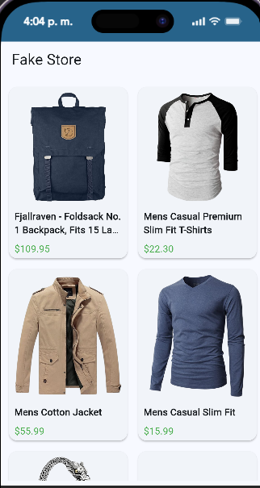

# Fake Store API Flutter App

A Flutter application that consumes the Fake Store API and displays products using a layered architecture inspired by Clean Architecture principles. The project demonstrates API consumption, state management with Provider, dependency injection, and separation of concerns.

---

## Features

- Fetch products from Fake Store API
- Display product information including:
    - Product image
    - Product title
    - Product description
    - Product price
- State management using Provider
- Error handling for API requests
- Loading indicators during data retrieval
- Layered architecture for maintainability and scalability

---

## Architecture

The project follows a simplified Clean Architecture approach with three main layers:

```text
lib/
│
├── data/
│   ├── datasource/
│   │   └── storeapi_datasource.dart
│   ├── models/
│   │   └── store_model.dart
│   └── repositories/
│       └── store_repository_impl.dart
│
├── domain/
│   ├── entities/
│   │   └── store.dart
│   └── usecases/
│       └── get_store_usecase.dart
│
├── presentation/
│   ├── routes/
│   ├── viewmodel/
│   │   └── store_viewmodel.dart
│   └── views/
│
└── main.dart
```

---

## Architectural Layers

### Domain Layer

Contains the business rules and core entities.

#### Entity

```dart
Store
```

Represents a product with the following attributes:

- id
- title
- image
- price
- description

#### Use Case

```dart
GetStoreUseCase
```

Responsible for retrieving products from the repository and exposing them to the presentation layer.

---

### Data Layer

Handles data retrieval and transformation.

#### Data Source

```dart
StoreApiDataSource
```

Responsibilities:

- Connect to Fake Store API
- Execute HTTP requests
- Decode JSON responses
- Convert JSON into model objects

API Endpoint:

```text
https://fakestoreapi.com/products
```

#### Model

```dart
StoreModel
```

Maps API responses into application entities.

#### Repository

```dart
StoreRepositoryImpl
```

Acts as an intermediary between the domain and data layers.

---

### Presentation Layer

Handles UI and state management.

#### ViewModel

```dart
StoreViewModel
```

Responsibilities:

- Manage loading states
- Manage error states
- Store retrieved products
- Notify UI of changes

Main method:

```dart
loadProducts()
```

---

## Design Patterns Used

### Repository Pattern

Provides an abstraction between business logic and data sources.

```text
UseCase
    ↓
Repository
    ↓
DataSource
```

---

### MVVM (Model-View-ViewModel)

Separates UI from business logic.

```text
View
   ↕
ViewModel
   ↓
Model
```

---

### Dependency Injection

Dependencies are manually injected during application startup.

```dart
final datasource = StoreApiDataSource();
final repository = StoreRepositoryImpl(datasource);
final usecase = GetStoreUseCase(repository);
```

Benefits:

- Reduced coupling
- Easier testing
- Better maintainability

---

### Observer Pattern

Implemented through:

```dart
ChangeNotifier
notifyListeners()
```

Provider listens for state changes and automatically updates the UI.

---

## Technologies Used

| Technology | Purpose |
|------------|----------|
| Flutter | Cross-platform development |
| Dart | Programming language |
| Provider | State management |
| HTTP | REST API consumption |
| Fake Store API | Data source |

---

## Dependencies

```yaml
dependencies:
  flutter:
    sdk: flutter
  provider: ^6.1.5+1
  http: ^1.6.0
```

---

## Installation

### Clone the Repository

```bash
git clone https://github.com/Pa004/FakeStore_API.git
```

### Navigate to the Project

```bash
cd FakeStore_API
```

### Install Dependencies

```bash
flutter pub get
```

### Run the Application

```bash
flutter run
```

---

## API Reference

This project uses:

**Fake Store API**

Website:

https://fakestoreapi.com/

Products Endpoint:

```http
GET /products
```

Example Response:

```json
{
  "id": 1,
  "title": "Fjallraven Backpack",
  "price": 109.95,
  "description": "Your perfect pack...",
  "image": "https://..."
}
```

---

## Application Flow

```text
User Interface
        ↓
StoreViewModel
        ↓
GetStoreUseCase
        ↓
StoreRepositoryImpl
        ↓
StoreApiDataSource
        ↓
Fake Store API
```

---

## Error Handling

The application currently handles:

- Network failures
- Invalid API responses
- HTTP errors

Errors are propagated to the ViewModel and displayed in the user interface.

---

## Future Improvements

- Search products
- Product categories
- Pagination support
- Product details screen
- Local caching
- Unit testing
- Repository abstraction through interfaces
- Dependency injection framework (GetIt)

---

## Screenshots



### Home Screen

```text
assets/screenshots/home.png
```

### Product Details

```text
assets/screenshots/details.png
```

---

## Educational Purpose

This project was developed to practice:

- Flutter development
- REST API consumption
- Provider state management
- Clean Architecture concepts
- Repository Pattern
- MVVM Pattern
- Dependency Injection

---

## Author

**Pablo Domínguez**

GitHub:
https://github.com/Pa004

---

## License

This project is intended for educational purposes.